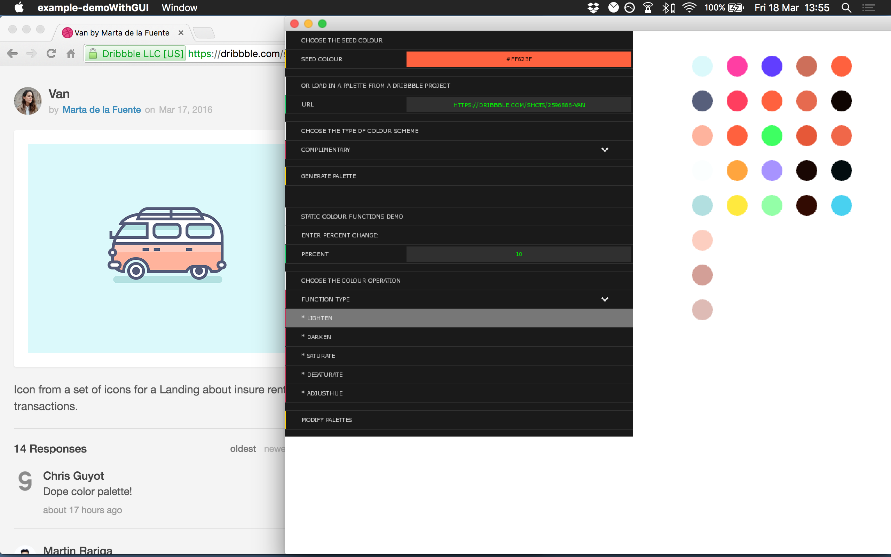

ofxAlbers
===========================
## what
**ofxAlbers** is an addon for OpenFrameworks providing an easy interface to creating colour palettes - either by scrapping a Dribbble shot or via more traditional Colour Theory.

### [Full docs](http://james-oldfield.github.io/ofxAlbers)

*A quick demo generating colour schemes from Dribbble shots and standard colour theory palettes (Demo can be found in `./example-demoWithGUI`)*

## how

### See full docs [here](http://james-oldfield.github.io/ofxAlbers). The following is a very basic example of how to use some of the methods:

#### Creating a new palette from a Dribbble shot

(**Caveat**: Assumes a very specific HTML structure as there is no public API exposed, potential to change.)

    shared_ptr< vector<ofColor> > colours;

    DribbblePalette * palette;
    colours = palette->createPalette("https://dribbble.com/shots/2585138-Sunset-Badge");

#### Creating a new theory palette

    AnalogousPalette * palette;
    palette->createPalette(ofColor(255, 255, 0));

#### Using the static colour functions

    ofColor myCol = ofColor(255, 0, 0);
    ColourPalette::lighten(myCol, 20);

#### Performing operations on whole palettes

    MonochromePalette * palette;
    palette->darken(20);

#### Assigning and copying palettes

    // Can be performed like expected, as the shared pointers are handled.
    TriadPalette triad1;
    triad1.createPalette(ofColor(255, 0, 0));

    TriadPalette triad2 = triad1;